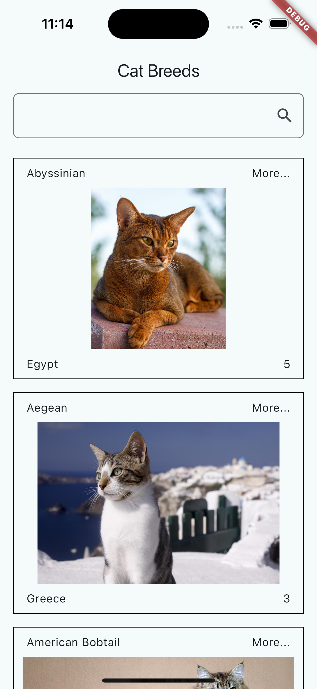
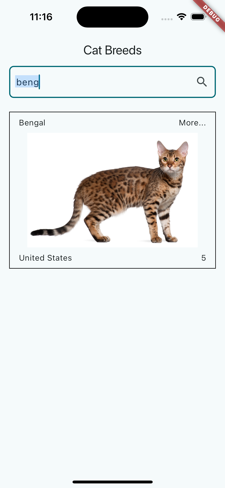
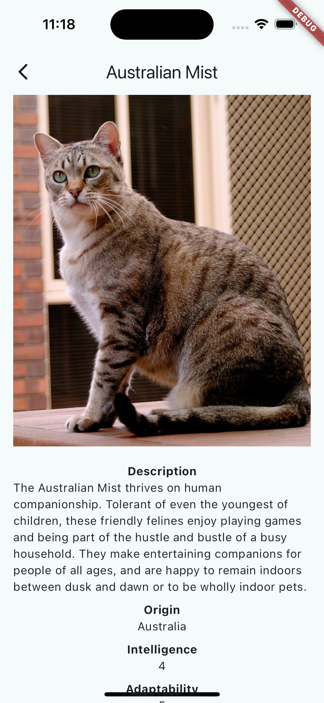

# Cat Breeds App

Cat Breeds App is a Flutter application that displays information about different cat breeds. The app allows users to search and filter cat breeds by name and provides details about each breed, including its description, origin, intelligence, adaptability, and lifespan.

## Features

- Search and filter cat breeds by name.
- View details of each cat breed, including:
  - Description
  - Origin
  - Intelligence
  - Adaptability
  - Lifespan
- Lazy-loaded cat images with error handling.

## Screenshots






## Flutter version
3.22.0


## Installation

1. Clone this repository:
```sh
git clone https://github.com/idamkiller/cat_breeds.git
```

2. Navigate to the project directory:
```sh
cd cat_breeds
```

3. Copy the .env.example file to .env and configure the parameters it contains:
```sh
cp .env.example .env
```

3. Install the dependencies
```
flutter pub get
```

4. Run the application:
```
flutter run
```

## Author
> Ivan Avila - Email: idam1988@gmail.com